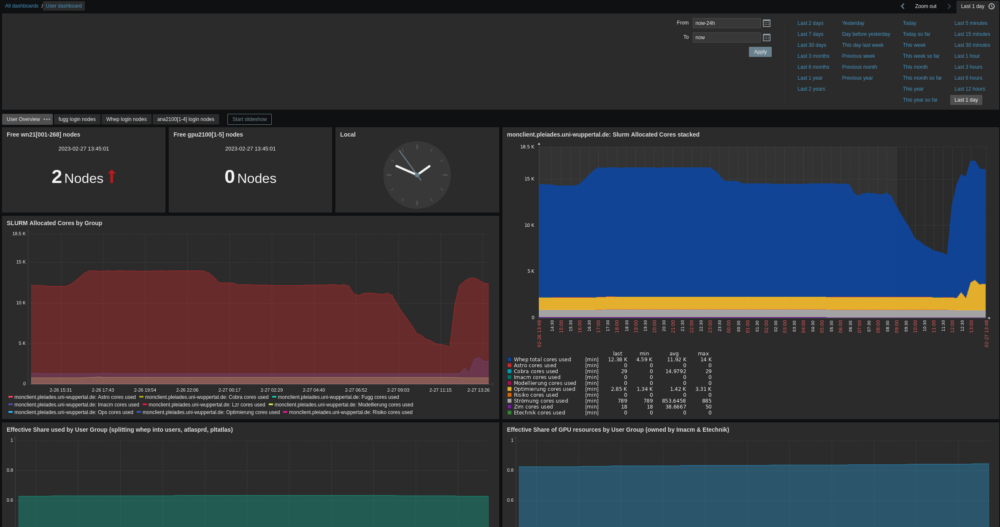
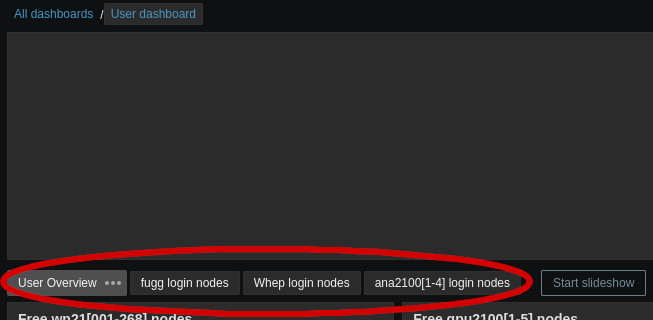
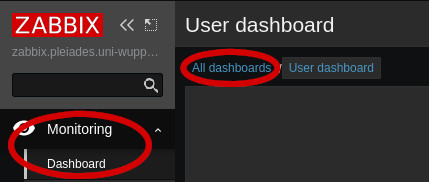
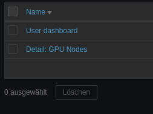
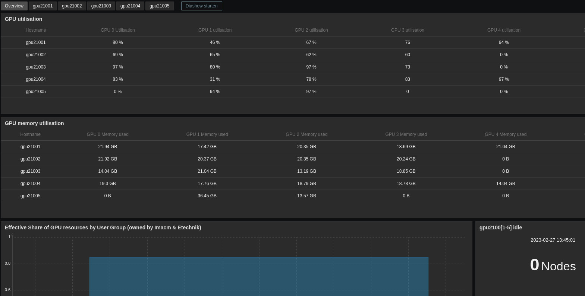
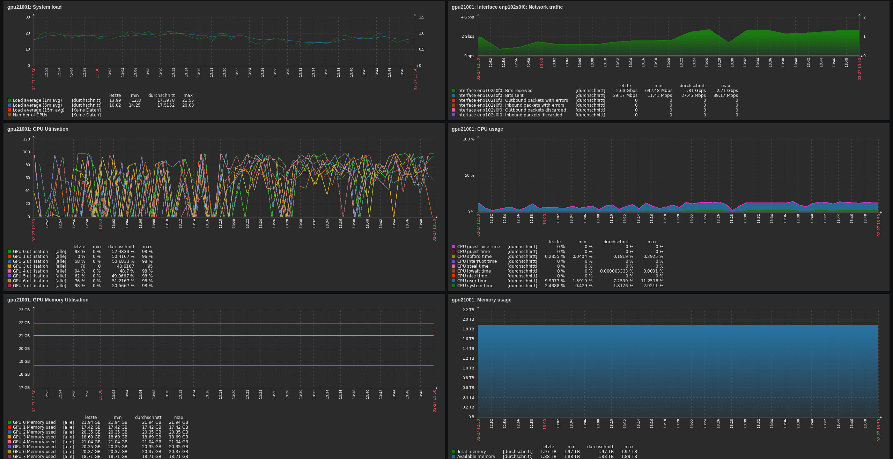

## Getting Started: Monitoring
Our monitoring service can be accessed at [zabbix.pleiades.uni-wuppertal.de](https://zabbix.pleiades.uni-wuppertal.de/) with the credentials "pleiades" and "pleiades".
Zabbix collects various information regarding current and past resource usage and quotas.

### Dashboard
After login you are typically greeted by the user overview dashboard:

There are also multiple sub-pages available, covering an overview and login-node-specific metrics:

The overview dashboard presents aggregated metrics and you can select the time frame of presented information on the top right.
The visible widgets are:
* Number of free (idle) worker or gpu nodes
* Current time
* **SLURM Allocated Cores by Group** (2 plots): Current allocation of Cores per group as reported by Slurm
* **Effective Share used by User Group**: Slurm CPU resource usage for each group (resets each month)
* **Effective Spare of GPU resources by User Group**: Slurm GPU resource usage for each group (resets each month)
* **Beegfs Group Quota** (% and TB): Information on how much space is available on BeeGFS per group

More detailed pages about each class of login nodes provide information about:
* **Number of logged in users**
* **CPU usage**
* **Memory usage**

You can change the displayed dashboard through `Monitoring > Dashboard > All dashboards > user overview`:

All available user dashboards are:

### GPU Dashboard
Another dashboard shows detailed information of all five gpu nodes, `gpu2100[1-5]`:

You can select separate pages for each gpu node, which provide detailed information:

These pages can help you answer questions like:
* How much memory is available on a specific GPU? (8 GPUs per node)
* How good is the utilization of a specific GPU?
* How busy is the node CPU or memory?
* How busy is the nodes network interface?
* How much power does the GPU consume?

If you know which GPUs your job is using, or if you use a whole node exclusively, this approach can help to assess your software performance.

### Detailed Information
To get detailed information about a single node, e.g. to see if a node you are currently working on is using its resources, you can go to the `Monitoring > Graphs` tab.

First you need to select a group of hosts, e.g. `Worker Nodes`:

Within this group, you can select a specific host, e.g. `wn21001` or `gpu21001`:

The `Graph` drop down menu provides a range of metrics to investigate, e.g. `CPU` or `Memory utilization`.
A graph in the bottom represents the data for this particular host with the usual options to specify a time frame:

