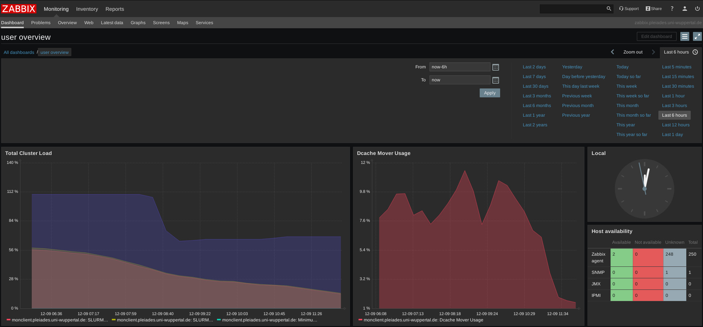
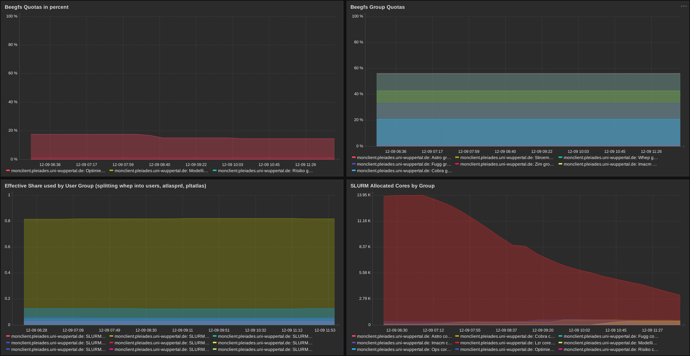
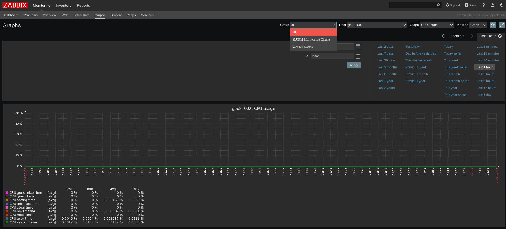
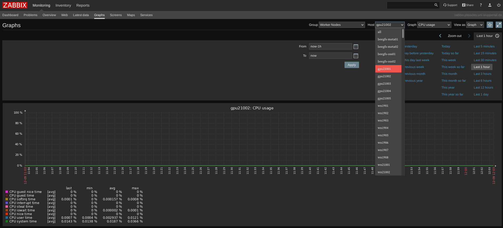
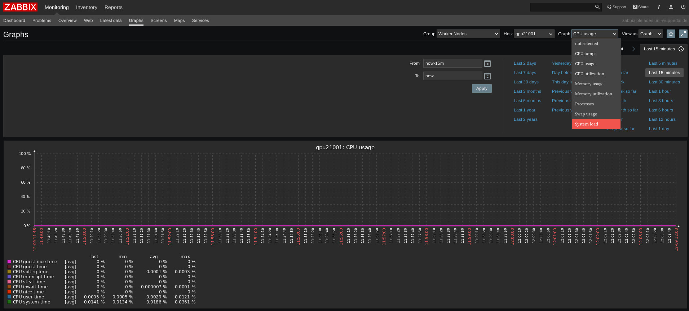

## Getting Started: Monitoring
Our monitoring service can be accessed at [zabbix.pleiades.uni-wuppertal.de](https://zabbix.pleiades.uni-wuppertal.de/) with the credentials "pleiades" and "pleiades".
Zabbix collects various information regarding current and past resource usage and quotas.

### Dashboard
After login you are typically greeted by the user overview dashboard:

If it is not selected, you can access it by clicking `Monitoring > Dashboard > All dashboards > user overview`.

The overview dashboard collects a couple of aggregated metrics and you can select the time frame of presented information on the top right.
The visible graphs are:
* **Total Cluster Load**: Average and maximum load on workernodes. This can give you a hint on how busy the CPUs are on all nodes
* **Dcache Mover Usage**: Activity of our dCache storage system (only relevant for ATLAS jobs).
* **Beegfs Group Quotas**: Information on how much space is available on BeeGFS per group.
* **Effective Share used by User Group**: Effective usage of each group as reported by Slurm. Usage resets every month.
* **SLURM Allocated Cores by Group**: Current allocation of Cores per group as reported by Slurm.

### Detailed Information
To get detailed information about a single node, e.g. to see if a node you are currently working on is using its resources, you can go to the `Monitoring > Graphs` tab.

First you need to select a group of hosts, e.g. `Worker Nodes`:

Within this group, you can select a specific host, e.g. `wn21001` or `gpu21001`:

The `Graph` drop down menu provides a range of metrics to investigate, e.g. `CPU` or `Memory utilization`.
A graph in the bottom represents the data for this particular host with the usual options to specify a time frame:

