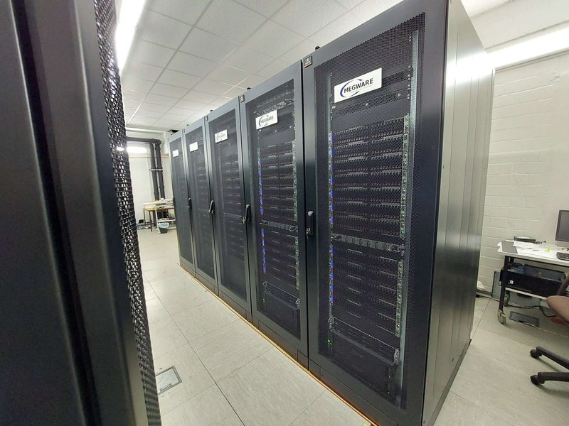

### PLEIADES User Documentation
Welcome to the user documentation of the PLEIADES cluster at the University of Wuppertal.
On this page you can find an introduction to our cluster, as well as answers to common questions and best practices.

If you are a new user, please read our [introduction]({{ site.baseurl }}), the [hardware description]({{ site.baseurl }}) and about [best practices]({{ site.baseurl }}).
There is also more information about Slurm, using GPU nodes, MPI and available Software.

In case of further questions you can contact us at

**pleiades{at}uni-wuppertal.de**

More resources:
  - [Official PLEIADES page](http://pleiades.uni-wuppertal.de/)
  - The [hpc-wiki.info](https://hpc-wiki.info/) contains many useful explanations about HPC topics, as well as [Tutorials](https://hpc-wiki.info/hpc/Category:Tutorials), covering
    - Linux introduction
    - Profiling with gprof
    - OpenMP porgramming
    - GPU programming
