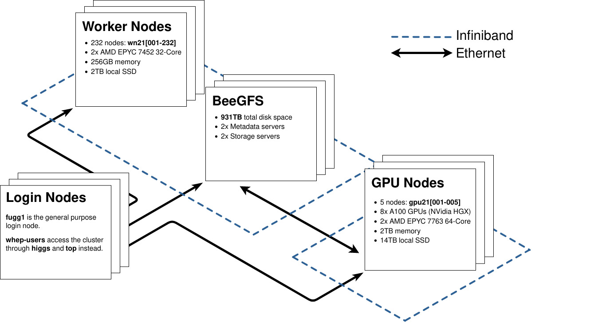

### Getting an account
If you belong to one of the groups participating in PLEIADES, you can get an account by filling out [this form.](http://pleiades.uni-wuppertal.de/fileadmin/physik/pleiades/Accountantrag.pdf)

If your group was **not** involved in PLEIADES, please ask your group leader to contact the support before submitting an account request!


### Questions/Support
In case of questions and problems, please use the following email address:

**lcg-admin{at}physik.uni-wuppertal.de**


### First Login and password change
You will receive your initial password from the administrators after your group leader has countersigned the user application. You can change your password on any PLEIADES login machine by just using the

```bash
passwd
```

command.


### Login (all users except "whep" users)
There is one login machine from which the cluster can be operated. It is:

```
fugg1.pleiades.uni-wuppertal.de
```

This node can be used to develop and test code. Once this is finished jobs can be submitted to the pleiades cluster. This machine runs CentOS 7. You can login on it using your username, which will be provided by us.
Due to massive attacks from all over the world, SSH access is limited to IPs from inside the university's network (`132.195.0.0/16`). In addition, a protection system is used that blocks IP numbers which have been used with several unsuccessful logins. So if you mistype your credentials too often, you will be locked out for a while.

A good practice for using ssh regularly is to setup ssh-keys on your local machine and use

```bash
ssh-copy-id USERNAME@fugg1.pleiades.uni-wuppertal.de
```

(from your local machine) to enable a key-based login on the frontend.


### Login (whep users)

The login mechanism for whep users is the same as for all other users, except for the login nodes. There are 2 login nodes running CentOS 7 (recommended)

```bash
higgs.pleiades.uni-wuppertal.de
top.pleiades.uni-wuppertal.de
```

**Only whep users can log into higgs and top!!!**


### File System
A [BeeGFS](https://www.beegfs.io/) cluster file system is installed on fugg1.pleiades.uni-wuppertal.de login machine and on all cluster worker nodes, i.e. the file system is shared among all nodes and can be used to develop code and to save output files from cluster jobs.  In general, no „copy constructions“ are needed. A group quota according to the share of each participating group has been applied. If needed additional user quotas can also be applied.  You find your home directory at:

```bash
/beegfs/USERNAME
```

if you need real local space on the worker nodes, use „/tmp“, but please clean up inside your jobs scripts, otherwise you will overload the nodes.


**Heads up!**
There is no backup for the /beegfs file system. However, this file system is running on raid systems.


**Heads up! WHEP users**

You have a different home directory (`/common/home/USERNAME`).

Hence, you need to have the same files in
```bash
/common/home/USERNAME/.ssh
```
and

```bash
/beegfs/USERNAME/.ssh
```

This can easily be achieved by copying the whole directory.


### Hardware and Network
The CPU Worker nodes wn21[001-232] are connected to each other and to the BeeGFS servers via infiniband and ethernet.
All GPU nodes (gpu21[001-005]) are in a separate infiniband network and access BeeGFS via ethernet.
The login nodes are currently connected to all other nodes via ethernet.

[](assets/img/pleiades_layout.jpg)
