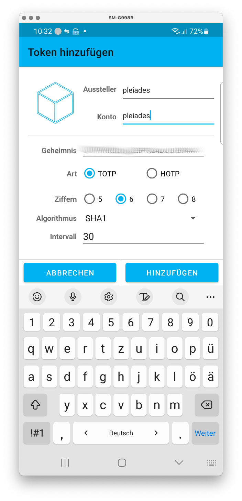

# 2 Factor Authentication on Pleiades

## Why?

To increase security significantly, [two-factor authentication](https://en.wikipedia.org/wiki/Multi-factor_authentication) requires a 2nd piece of evidence to log into the Pleiades cluster. 

We currently offer [TOTP](https://en.wikipedia.org/wiki/Time-based_one-time_password) (Time-based one-time password) logins, which usually require no additional hardware on the user's side - any smartphone is enough. Some people call that "Google Authenticator" because Google implented one reference of this method. But the [standard](https://datatracker.ietf.org/doc/html/rfc6238) is completely open.

Once activated, you need to use an app on your smartphone which will present you a time-limited code, which you have to enter **additionally** before you will be granted access.

Example of such a login (**bold** text for emphasis of input):

<pre>
Torsten-Harenbergs-MacBook-Air-2:~ harenber$ <b>ssh fugg2.pleiades.uni-wuppertal.de</b>
(harenber@fugg2.pleiades.uni-wuppertal.de) Password:
(harenber@fugg2.pleiades.uni-wuppertal.de) Verification code:
</pre>

Afterwards, you are greeted with the usual splash screen:

```
Last login: Mon Mar  6 10:29:23 2023 from guckloch.pleiades.uni-wuppertal.de

######
#     #  #       ######     #      ##    #####   ######   ####
#     #  #       #          #     #  #   #    #  #       #
######   #       #####      #    #    #  #    #  #####    ####
#        #       #          #    ######  #    #  #            #
#        #       #          #    #    #  #    #  #       #    #
#        ######  ######     #    #    #  #####   ######   ####

Cluster documentation:
https://pleiadesbuw.github.io/PleiadesUserDocumentation/

General information and tutorials:
https://hpc-wiki.info/

Contact in case of questions or problems:
pleiades@uni-wuppertal.de

NEWS:
- 2023-02-28: New GPU dashboard available in our zabbix monitoring service.
              It provides detailed information about GPU utilization.
              See our documentation for more information.
- 2023-02-27: Maintenance is finished and all nodes are accepting jobs again.
- 2022-07-27: In light of the recent security incident: Our Cluster is not
              affected, but we want to remind you that BeeGFS is not backed up.
              Make sure to store important results and data on an external
              device.

[harenber@fugg2 ~]$
```

## How you can use it.

### Step 1: Install an App on your smart phone

You will need an app implementing the TOTP standard. There are plenty available, however we would strongly recommend to use a free and open-sourced app.

#### Android

For Android, we recommend [FreeOTP+](https://github.com/helloworld1/FreeOTPPlus) which is available from [Google Play](https://play.google.com/store/apps/details?id=org.liberty.android.freeotpplus) and [F-Droid](https://f-droid.org/de/packages/org.liberty.android.freeotpplus/).

Once installed, you need to configure FreeOTP+ to protect your TOTPs. Most modern smartphones offer the use of biometrics like using your fingerprint.  That makes it really easy to use FreeOTP+. But you can also choose a password to protect the access.

#### iOS

For Apple devices, [2FAS](https://apps.apple.com/de/app/2fa-authenticator-2fas/id1217793794) is probably your best choice.

### Step 2: configure TOTP on Pleiades

This step is only required **once**

Log into any Pleiades Login node (whep users: please use higgs or top for that) and type `google-authenticator`.

The program will ask you a couple of questions, the answers are in **bold** and remarks in *italics*:

<pre>
[harenber@fugg2 ~]$ <b>google-authenticator</b>

Do you want authentication tokens to be time-based (y/n) <b>y</b>

Warning: pasting the following URL into your browser exposes the OTP secret to Google:
  https://www.google.com/chart?` <i>Just ignore the link</i>
</pre>

Continuing, you will be presented a QR Code, a secret key, a verification code and multiple scratch codes (covered in the FAQ). *This is the important part. You will need to scan the QR code with your phone's TOTP app and you should write down the secret key and codes.*

<pre>
Your new secret key is: <i>this is your secret key. Write it down and keep it in a safe place</i>
Your verification code is: <i>write this down</i>
Your emergency scratch codes are: <i>write them also down and keep them in a safe place</i>

Do you want me to update your "/common/home/harenber/.google_authenticator" file? (y/n) <b>y</b>

Do you want to disallow multiple uses of the same authentication
token? This restricts you to one login about every 30s, but it increases
your chances to notice or even prevent man-in-the-middle attacks (y/n) <b>n</b>


By default, a new token is generated every 30 seconds by the mobile app.
In order to compensate for possible time-skew between the client and the server,
we allow an extra token before and after the current time. This allows for a
time skew of up to 30 seconds between authentication server and client. If you
experience problems with poor time synchronization, you can increase the window
from its default size of 3 permitted codes (one previous code, the current
code, the next code) to 17 permitted codes (the 8 previous codes, the current
code, and the 8 next codes). This will permit for a time skew of up to 4 minutes
between client and server.
Do you want to do so? (y/n) <b>n</b>

If the computer that you are logging into isn't hardened against brute-force
login attempts, you can enable rate-limiting for the authentication module.
By default, this limits attackers to no more than 3 login attempts every 30s.
Do you want to enable rate-limiting? (y/n) <b>n</b>
</pre>

> **Shortcut** If you're sick of answering each question one by one, here is the shortcut passing the right options to the command above: 
<pre>
[harenber@fugg2 ~]$ <b>google-authenticator -u -t  -D -f -W</b>
</pre>

> **ATTENTION WHEP USERS** You have two home directories: the NFS-based /common/home/*username* on top/higgs and /beegfs/*username* on the cluster nodes. Please configure TOTP on top/higgs and once you're finished with the step above, copy the file `.google_authenticator' to your /beegfs/*username* directory.

### Step 3: inserting the secret key into your phone app

This is the easiest step. Use the QR scan method of your app (in FreeOTP+ on the bottom right) and scan the QR code from your terminal. Done.

If that does not work, you may add the secret key by hand:

[](assets/img/freeotp_add_secret.png)

### Step 4: enter the verfication code now every time you login

When you login to any Pleiades login node, you will be asked now two questions:

`(account@loginnode.pleiades.uni-wuppertal.de) Password:` **Here you enter your usual password**\
`(account@loginnode.pleiades.uni-wuppertal.de) Verification code:` **Here you enter the time limited code provided by your smart phone app**

# FAQ

- Are passwordless logins impossible with TOTP?

   No. If you're using ssh keys, you can use them as usual. TOTP only affects password-based logins.

- What if I loose my phone / get a new phone?

   If you've written down the secret, you can restore your TOTP on a different device. In addition, FreeOTP+ on Android allows you to export and import your secrets, 2FAS on iOS offers backup/restore in iCloud. In fact, it maskes sense to install a TOTP app on two devices in case you cannot use one. If you fear that you phone is compromized / stolen, you can reset TOTP (see next question).

- I think my secret is compromized.

   You can reset TOTP by deleting `.google_authenticator` in your home directory and start again from step 2 above.

- How to I get rid of this?

   Just delete `.google_authenticator` in your home directory.
   
- TOTP sucks, why don't you provide FIDO2 keys?

   Currently, some of our users still require Red Hat Enterprise Linux 7 which makes it nearly impossible to use FIDO2. 
   
- What are these `emergency scratch codes` that I should write down?

   These codes *replace* a TOTP secret *once*. So if you cannot use TOTP for whatever reason, each of these codes will replace the TOTP secret. But once you use a code, this one gets invalid (that's why they are called *scratch codes*). 

- HELP! HELP! HELP! I locked myself out!

   As usual, your friendly cluster admins are there to help. Just [send us a mail to create a ticket](mailto:pleiades@uni-wuppertal.de).
